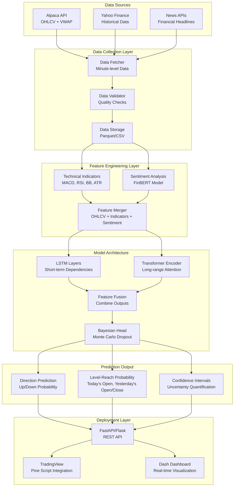
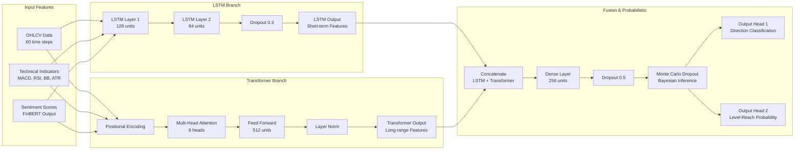
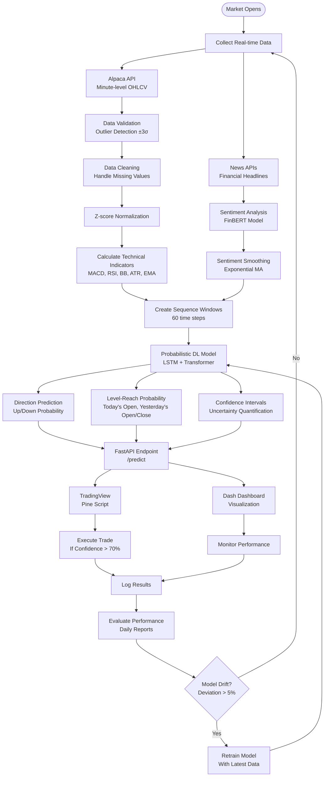
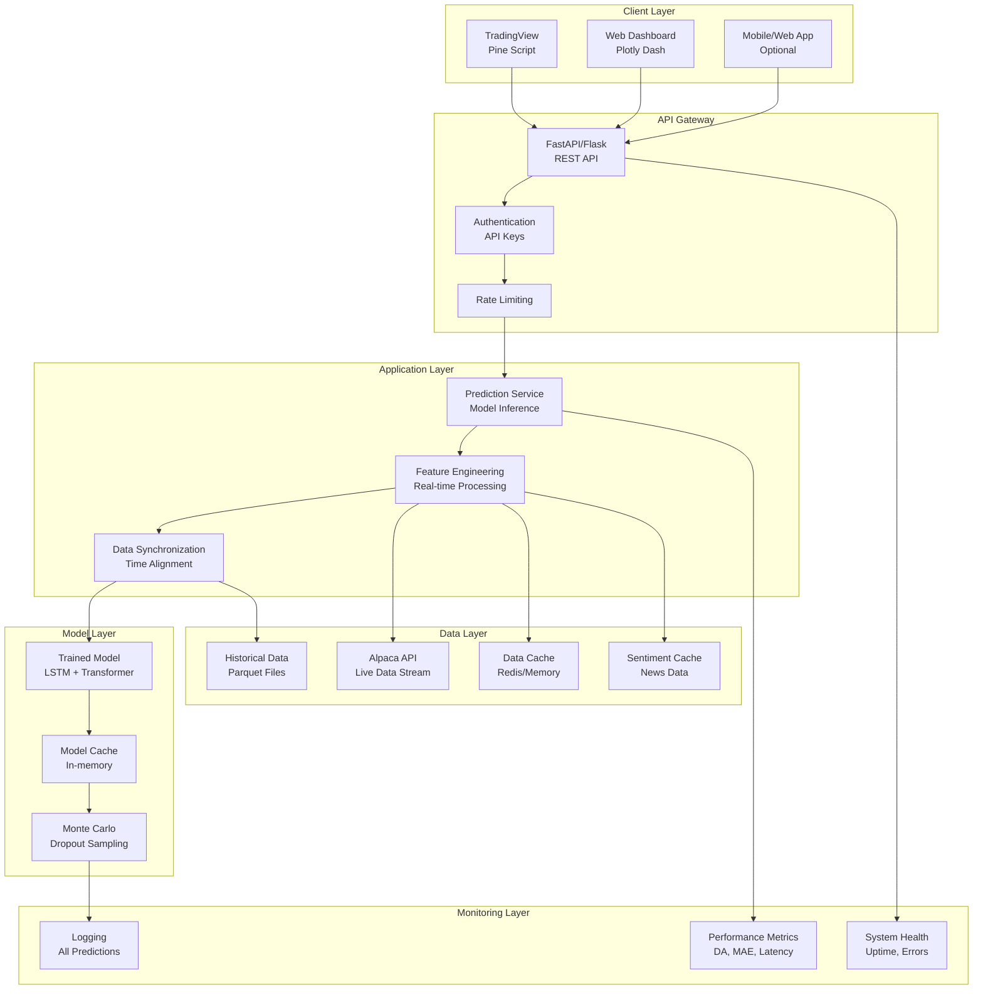
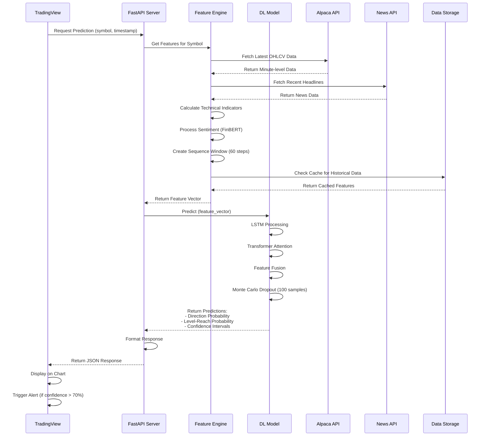
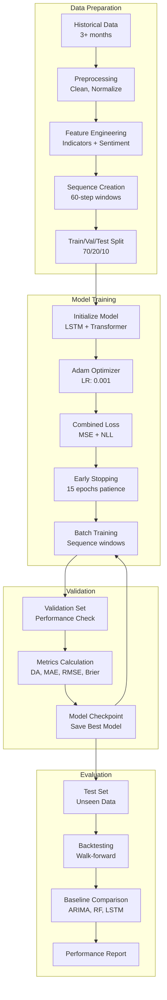
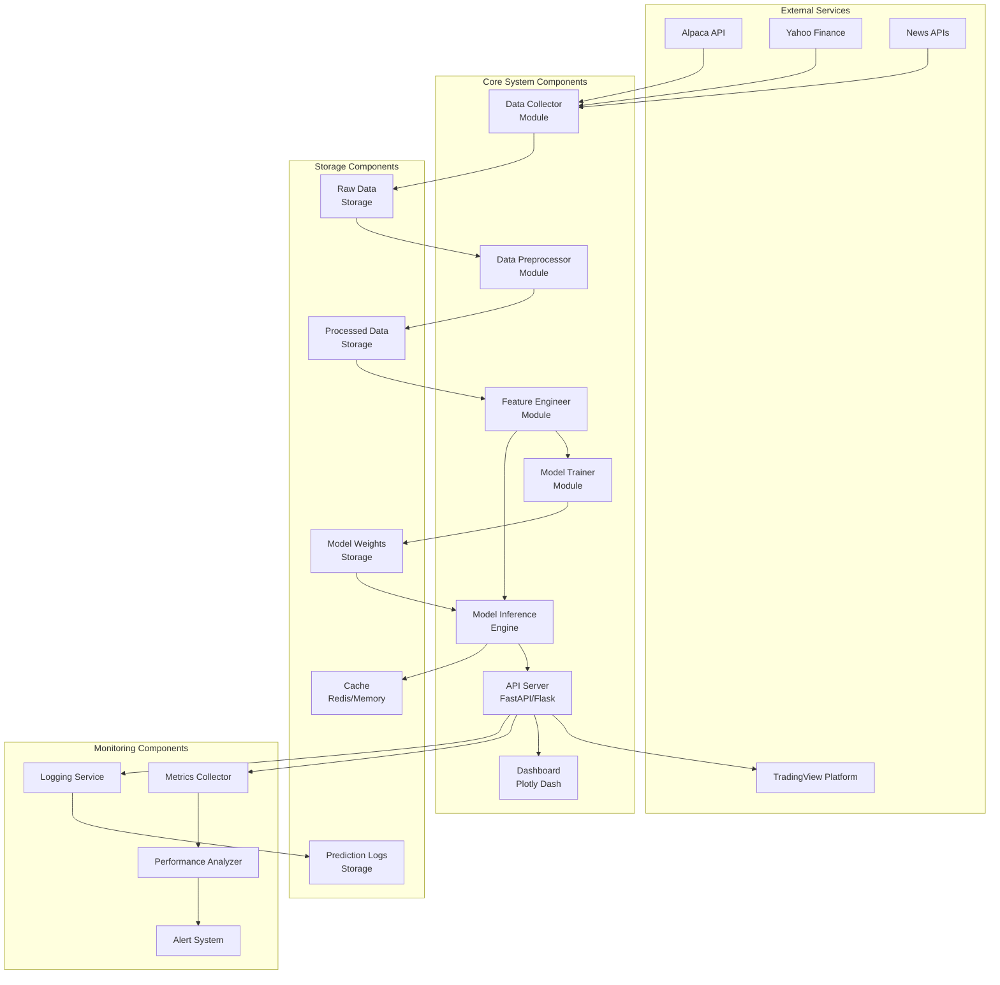
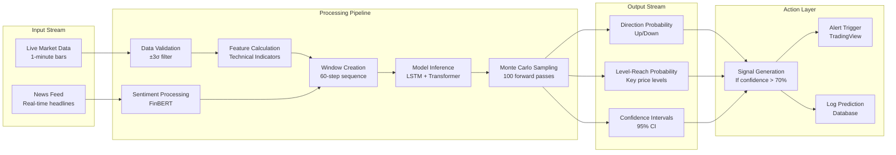

# Probabilistic Intraday Trading Forecast System - Architecture Diagrams

This document contains comprehensive Mermaid diagrams illustrating the system architecture, data flow, model design, and deployment structure.

## 1. High-Level System Architecture

## 2. Detailed Model Architecture

## 3. Data Flow Architecture

## 4. Deployment Architecture

## 5. Component Interaction Sequence

## 6. Training Pipeline Architecture

## 7. System Component Diagram

## 8. Real-time Processing Flow

## Architecture Notes

### Key Design Principles:
1. **Modularity:** Each component is independent and can be developed/tested separately
2. **Scalability:** System can handle multiple assets and concurrent requests
3. **Reliability:** Multiple data sources and caching for fault tolerance
4. **Low Latency:** Caching, optimized inference, and efficient data pipelines
5. **Observability:** Comprehensive monitoring and logging at every layer

### Technology Stack:
- **Backend:** Python 3.11, FastAPI/Flask
- **ML Framework:** TensorFlow/PyTorch
- **Data Processing:** Pandas, NumPy
- **Technical Indicators:** pandas_ta
- **Visualization:** Plotly Dash, Matplotlib
- **Storage:** Parquet files, Redis (cache)
- **APIs:** Alpaca, Yahoo Finance, News APIs
- **Deployment:** Docker (optional), Cloud/Edge

### Performance Targets:
- **Inference Latency:** <200 ms end-to-end
- **System Uptime:** ≥99%
- **Prediction Accuracy:** ≥90% directional accuracy
- **Throughput:** Handle 100+ requests/minute

